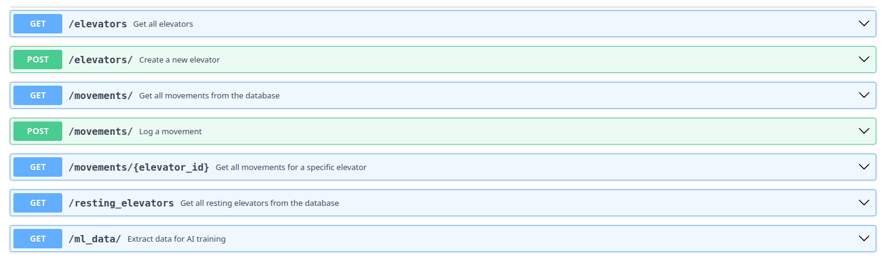

# Solution for the devtest at CriticSheep
## Elevator Management System

###
The solution implements a database model using SQLAlchemy, I've also add some Pydantic schemas for request validation.
There are different endpoints implemented with FastAPI.
Some simple test is created using unittest.

## Run the project
### Install required packages
```sh
pip install -r requirements.txt
```

### Init DB
```sh
sqlite3 elevator.db < database/db-schema.sql``
```

### Run the app
```sh
uvicorn app.main:app
```

The application will be available at ``http://127.0.0.1:8000/docs``

### Endpoints
